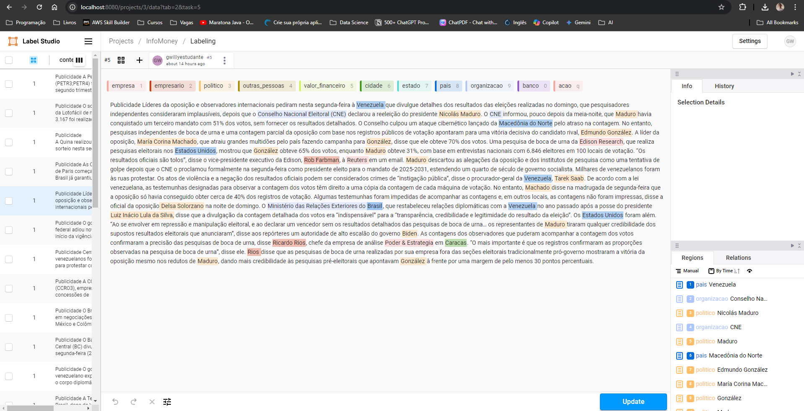

# BERT-Token-Classification

## Índice
- [Como Usar](#como-usar)
- [Descrição](#descrição)
- [Dependências](#dependências)
- [Outros Materiais](#outros-materiais)

## Como Usar

Baixe o arquivo [BERT_Final.ipynb](BERT_Final.ipynb), abra-o utilizando o Google Colab. Clique em Runtime > Change runtime type > T4 GPU. Execute bloco a bloco.

## Descrição

O objetivo deste projeto é resolver um problema de token classification. Primeiro, desenvolvemos um [Scraper](Scraper.ipynb) para coletar os dados de notícias da [InfoMoney.com.br](InfoMoney.com.br). Para isso, acessamos [InfoMoney.com.br/robots.txt](InfoMoney.com.br/robots.txt), acessamos o sitemap [https://www.infomoney.com.br/news-sitemap.xml](https://www.infomoney.com.br/news-sitemap.xml), e montamos um Scraper que coleta o título da notícia, a data de publicação e URL. Estes dados foram salvos no arquivo [news_data.csv](Dados/news_data.csv) Após isso, montamos um outro Scraper que lia este arquivo, acessava cada URL, copiava os dados e armazenava o conteúdo em [news_data.json](Dados/news_data.json).
O próximo passo foi abrir o Label-Studio e rotular a mão as primeiras 72 notícias coletadas. Utilizamos os seguintes rótulos:
1. empresa
2. empresario
3. politico
4. outras_pessoas
5. valor_financeiro
6. cidade
7. estado
8. pais
9. organizacao
10. banco

11. acao

Os dados rotulados foram salvos em [dataset_anotado.json](Dados/dataset_anotado.json), que foi convertido para .conll e depois para .parquet, sendo salvo como [annot.parquet](Dados/annot.parquet). Convertemos também o nosso dataset original para parquet, salvando em [news_data.parquet](Dados/news_data.parquet). O próximo passo foi realizar o treinamento do nosso modelo, utilizando o BERT (Bidirectional Encoder Representations from Transformers) para problema de Named Entity Recognition. O BERT utiliza os dados no formato .conll, porém, por utilizarmos o modelo [neuralmind/bert-large-portuguese-cased](https://huggingface.co/neuralmind/bert-large-portuguese-cased), precisamos adaptar para arquivos Apache Arrow, arquivos colunares (assim como .conll), e por isso, convertemos os nossos datasets para .parquet. Todo o treinamento do nosso modelo pode ser visto em [BERT.ipynb](BERT.ipynb). Abra o Google Colab e envie os datasets para ele poder utilizar os dados e fazer o treinamento por lá. Por fim, após treinar o modelo e avaliá-lo, pude observar uma taxa alta de precisão, o que indica que o modelo encontrou overfitting. Entre os motivos para isso, acredito que quatro são mais óbvios:
- Poucos dados de treinamento, apenas 72 notícias rotuladas. Para evitar overfitting, podemos futuramente rotular mais notícias e entregar um volume maior para o treinamento do modelo. Isso não foi feito desta vez porque esta etapa de Crawl Annotation foi feita manualmente nas 72 notícias, e demoraria muito implementar esta tática no restante.
- A presença de palavras sem rótulo era muito alta, enquanto a presença de palavras com rótulo era baixa. Por isso, a dificuldade em compreender bem os rótulos e entender quando os aplicar foi maior.
- A conversão para diferentes formatos (json >  conll > parquet) pode ter prejudicado a integridade dos dados
- O BERT não atua apenas com labels, como também sub labels, que são rótulos menores utilizados na hora de fazer a classificação. Isso se torna mais evidente ao exportar os resultados. Provavelmente, medidas para se precaver das sub labels deveriam ter sido tomadas.
Por mais que o overfitting tenha ocorrido, utilizamos nosso modelo e nosso tokenizer para rotular o restante dos dados. O resultado obtido está em [labeled_news_data.parquet](Dados/labeled_news_data.parquet), que foi convertido também para os formatos [.json](Dados/labeled_news_data.json), [.txt](Dados/label_news_data.txt) e [.csv](Dados/labeled_news_data.csv).

## Dependências

Python 3.8

!pip uninstall -y pyarrow requests fsspec

!pip install pyarrow==14.0.1 requests==2.31.0 fsspec==2024.6.1

!pip install cudf-cu12 gcsfs google-colab ibis-framework

!pip install transformers datasets torch seqeval pandas requires

# Outros Materiais

O vídeo com a explicação de como funcionou o projeto está disponível [neste link](https://www.youtube.com/watch?v=5lvui9VSOOg).

Este trabalho virou um artigo no Medium, e pode ser acessado por [este link](https://medium.com/@gwillye/token-classification-com-bert-aplica%C3%A7%C3%A3o-do-bert-em-um-desafio-de-named-entity-recognition-ner-e73c4ef67d03)
