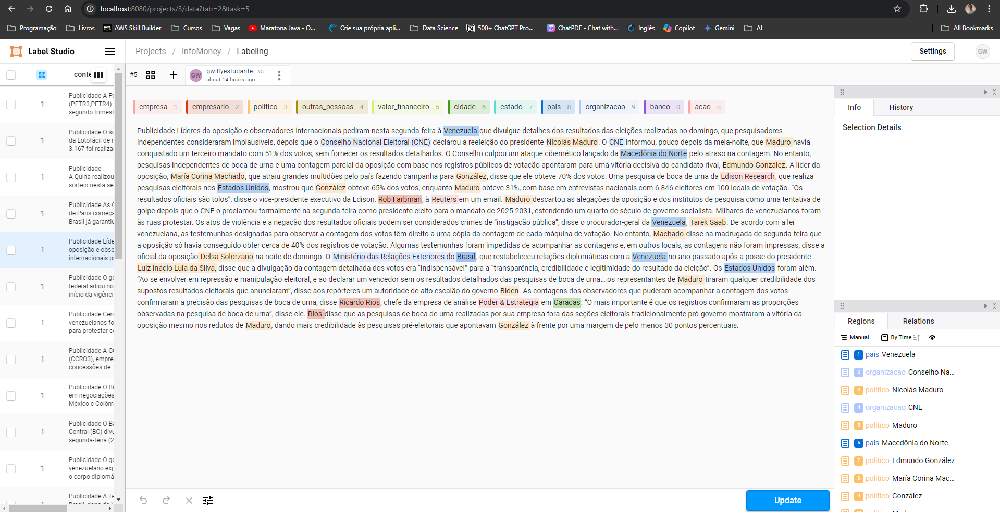

# BERT Token Classification

Treinamento de um modelo BERT (Bidirectional Encoder Representations from Transformers) para um problema de Token Classification, mais especificamente Named Entity Recognition (NER) sobre notícias de finanças em português.

O projeto cobre o pipeline inteiro: coletar as notícias com um scraper, rotular as entidades à mão, treinar o modelo e usá-lo para rotular o restante dos dados. Abaixo explico cada etapa, os resultados (incluindo o overfitting que apareceu) e como rodar tudo.

## Índice

- [O que o projeto faz](#o-que-o-projeto-faz)
- [Como os dados foram coletados](#como-os-dados-foram-coletados)
- [Rotulagem](#rotulagem)
- [Treinamento do modelo](#treinamento-do-modelo)
- [Resultados](#resultados)
- [Como rodar](#como-rodar)
- [Dependências](#dependências)
- [Outros materiais](#outros-materiais)

## O que o projeto faz

O objetivo é resolver um problema de token classification, ou seja, classificar cada token (palavra) de um texto dentro de uma categoria de entidade. Para isso usamos o BERT aplicado a Named Entity Recognition, treinando em cima de notícias coletadas da [InfoMoney.com.br](https://www.infomoney.com.br).

## Como os dados foram coletados

Primeiro desenvolvemos um [Scraper](Scraper.ipynb) para coletar as notícias. Começamos consultando o [robots.txt](https://www.infomoney.com.br/robots.txt) do site e o sitemap em [news-sitemap.xml](https://www.infomoney.com.br/news-sitemap.xml), e a partir daí montamos um scraper que coleta o título da notícia, a data de publicação e a URL. Esses dados foram salvos em [news_data.csv](Dados/news_data.csv).

Em seguida montamos um segundo scraper que lia esse arquivo, acessava cada URL, copiava os dados e armazenava o conteúdo em [news_data.json](Dados/news_data.json).

## Rotulagem

O próximo passo foi abrir o Label Studio e rotular à mão as primeiras 72 notícias coletadas. Usamos os seguintes rótulos:

1. empresa
2. empresario
3. politico
4. outras_pessoas
5. valor_financeiro
6. cidade
7. estado
8. pais
9. organizacao
10. banco
11. acao



Os dados rotulados foram salvos em [dataset_anotado.json](Dados/dataset_anotado.json), que foi convertido para .conll e depois para .parquet, sendo salvo como [annot.parquet](Dados/annot.parquet). Convertemos também o dataset original para parquet, salvando em [news_data.parquet](Dados/news_data.parquet).

## Treinamento do modelo

Com os dados prontos, partimos para o treinamento usando o BERT para o problema de Named Entity Recognition. O BERT trabalha com dados no formato .conll, mas como usamos o modelo [neuralmind/bert-large-portuguese-cased](https://huggingface.co/neuralmind/bert-large-portuguese-cased), precisamos adaptar para arquivos Apache Arrow, que são colunares (assim como o .conll). Por isso convertemos os datasets para .parquet.

Todo o treinamento está em [BERT.ipynb](BERT.ipynb). Para reproduzir, abra o notebook no Google Colab e envie os datasets para que ele possa usar os dados e fazer o treinamento por lá.

## Resultados

Depois de treinar e avaliar o modelo, observei uma taxa muito alta de precisão, o que na prática indica overfitting. Entre os motivos para isso, acredito que quatro são os mais óbvios:

- Poucos dados de treinamento, apenas 72 notícias rotuladas. Para evitar overfitting, podemos futuramente rotular mais notícias e entregar um volume maior para o treinamento. Isso não foi feito desta vez porque a etapa de Crawl Annotation foi feita manualmente nas 72 notícias, e levaria muito tempo aplicar essa estratégia ao restante.
- A presença de palavras sem rótulo era muito alta, enquanto a presença de palavras com rótulo era baixa. Isso aumentou a dificuldade de compreender bem os rótulos e de entender quando aplicá-los.
- A conversão entre diferentes formatos (json para conll para parquet) pode ter prejudicado a integridade dos dados.
- O BERT não atua apenas com labels, mas também com sub labels, que são rótulos menores usados na hora de fazer a classificação. Isso fica mais evidente ao exportar os resultados. Provavelmente medidas para lidar com as sub labels deveriam ter sido tomadas.

Mesmo com o overfitting, usamos o modelo e o tokenizer para rotular o restante dos dados. O resultado está em [labeled_news_data.parquet](Dados/labeled_news_data.parquet), que também foi convertido para os formatos [.json](Dados/labeled_news_data.json), [.txt](Dados/label_news_data.txt) e [.csv](Dados/labeled_news_data.csv).

## Como rodar

Baixe o arquivo [BERT_Final.ipynb](BERT_Final.ipynb) e abra-o no Google Colab. Vá em Runtime > Change runtime type > T4 GPU. Em seguida, execute bloco a bloco.

## Dependências

Python 3.8.

```bash
!pip uninstall -y pyarrow requests fsspec
!pip install pyarrow==14.0.1 requests==2.31.0 fsspec==2024.6.1
!pip install cudf-cu12 gcsfs google-colab ibis-framework
!pip install transformers datasets torch seqeval pandas requires
```

## Outros materiais

O vídeo com a explicação de como o projeto funcionou está disponível [neste link](https://www.youtube.com/watch?v=5lvui9VSOOg).

Este trabalho também virou um artigo no Medium, que pode ser acessado por [este link](https://medium.com/@gwillye/token-classification-com-bert-aplica%C3%A7%C3%A3o-do-bert-em-um-desafio-de-named-entity-recognition-ner-e73c4ef67d03).
